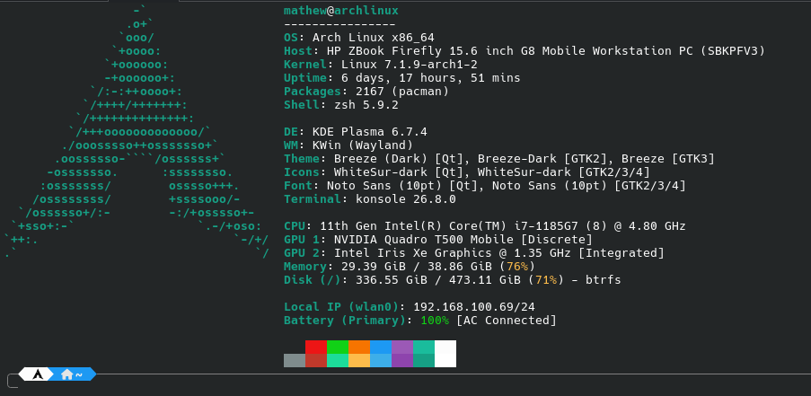
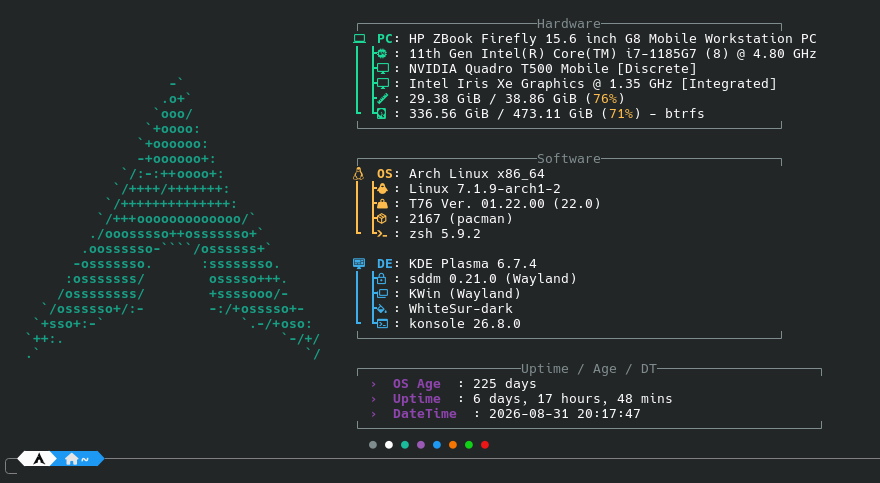

# fastfetch designs

Config designs for [`fastfetch-cli/fastfetch`](https://github.com/fastfetch-cli/fastfetch), 

## 1.Clone

```sh
git clone https://github.com/mathewmusango/my-configs.git
cd my-configs
```

## **2. Install fastfetch** (if not present)

```sh
# Arch
sudo pacman -S fastfetch
# Debian/Ubuntu
sudo apt install fastfetch
# Fedora
sudo dnf install fastfetch
```

## **3. Preview a design without installing**

```sh
fastfetch -c fastfetch/01-minimal/config.jsonc
fastfetch -c fastfetch/02-tree/config.jsonc
...
```

## **4. Activate a design** — Replace the current config

```sh
./fastfetch/replace.sh 01-minimal
or
./fastfetch/replace.sh 02-tree
...
```

## **5. Verify**

```sh
fastfetch
```

## **6. (Optional) Run on shell startup** — add this line to `~/.bashrc` and/or `~/.zshrc`:

```sh
fastfetch
```

## Designs

### 01 — Minimal (Default)



```sh
fastfetch -c 01-minimal/config.jsonc
```

### 02 — Tree / Box



```sh
fastfetch -c 02-tree/config.jsonc
```
