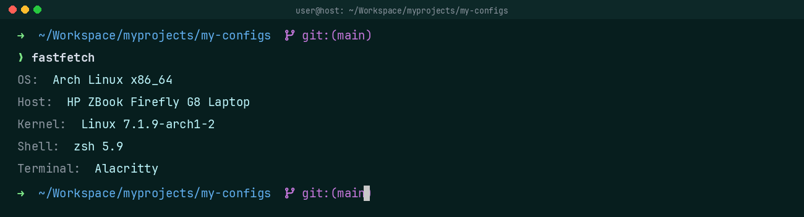

# Zsh(ohmyzsh) Config

**[`Ohmyzsh`](https://github.com/ohmyzsh/ohmyzsh)** + **[`Powerlevel10k`](https://github.com/romkatv/powerlevel10k)**, with **[`Fastfetch`](../fastfetch/README.md)** on startup.

**Plugins:**

- git
- podman
- autocomplete
- autosuggestions
- history-substring-search
- syntax-highlighting

### Setup

**1. Install zsh, git, curl** (git + curl are prerequisites for the Oh My Zsh installer)

```sh
# Arch
yay -S zsh git curl
# Debian/Ubuntu
sudo apt install zsh git curl
# Fedora
sudo dnf install zsh git curl
```

> **Note — Nerd Font:** the p10k prompt needs a Nerd Font (MesloLGS NF) — install it and select it in your terminal, or icons render as `□`. The same font also covers the fastfetch design icons:
> ```sh
> # Arch
> yay -S ttf-meslo-nerd-font-powerlevel10k
>
> # Debian/Ubuntu + Fedora (no package — download the TTFs)
> mkdir -p ~/.local/share/fonts
> curl -fLo ~/.local/share/fonts/MesloLGS\ NF\ Regular.ttf https://github.com/romkatv/powerlevel10k-media/raw/master/MesloLGS%20NF%20Regular.ttf
> curl -fLo ~/.local/share/fonts/MesloLGS\ NF\ Bold.ttf https://github.com/romkatv/powerlevel10k-media/raw/master/MesloLGS%20NF%20Bold.ttf
> curl -fLo ~/.local/share/fonts/MesloLGS\ NF\ Italic.ttf https://github.com/romkatv/powerlevel10k-media/raw/master/MesloLGS%20NF%20Italic.ttf
> curl -fLo ~/.local/share/fonts/MesloLGS\ NF\ Bold\ Italic.ttf https://github.com/romkatv/powerlevel10k-media/raw/master/MesloLGS%20NF%20Bold%20Italic.ttf
> fc-cache -f ~/.local/share/fonts
> ```
>
> **yay** is an AUR helper for Arch — see the [`yay`](../yay/README.md) module.

**2. Make zsh the default shell**

```sh
chsh -s "$(which zsh)"
```

Log out/in (or `exec zsh` for the session).

**3. Install Oh My Zsh**

```sh
sh -c "$(curl -fsSL https://raw.githubusercontent.com/ohmyzsh/ohmyzsh/master/tools/install.sh)"
```

Installs to `~/.oh-my-zsh` and creates a starter `~/.zshrc` (backs up an existing one).

**4. Install powerlevel10k**

```sh
git clone --depth=1 https://github.com/romkatv/powerlevel10k.git ${ZSH_CUSTOM:-$HOME/.oh-my-zsh/custom}/themes/powerlevel10k
```

**5. Install the plugins** (`git` and `podman` are built into Oh My Zsh):

```sh
git clone --depth=1 https://github.com/zsh-users/zsh-autosuggestions        ${ZSH_CUSTOM:-$HOME/.oh-my-zsh/custom}/plugins/zsh-autosuggestions
git clone --depth=1 https://github.com/zsh-users/zsh-history-substring-search ${ZSH_CUSTOM:-$HOME/.oh-my-zsh/custom}/plugins/zsh-history-substring-search
git clone --depth=1 https://github.com/zsh-users/zsh-syntax-highlighting    ${ZSH_CUSTOM:-$HOME/.oh-my-zsh/custom}/plugins/zsh-syntax-highlighting
git clone --depth=1 https://github.com/marlonrichert/zsh-autocomplete        ${ZSH_CUSTOM:-$HOME/.oh-my-zsh/custom}/plugins/zsh-autocomplete
```

**6. Install this config** — replaces the starter `~/.zshrc` from step 3 with this repo's wired-up one. The theme and plugins from steps 4–5 live in `~/.oh-my-zsh/custom/` and are **not** touched. (Already have this repo? Just run this step.)

```sh
./zsh(ohmyzsh)/install.sh        # copies zsh(ohmyzsh)/.zshrc -> ~/.zshrc (no symlinks)
```

**7. Load and configure the prompt**

```sh
exec zsh
p10k configure
```

`p10k configure` is an interactive wizard for prompt style/colors; it writes `~/.p10k.zsh`, which the config sources automatically.

### Screenshots

[](screenshot.png)
